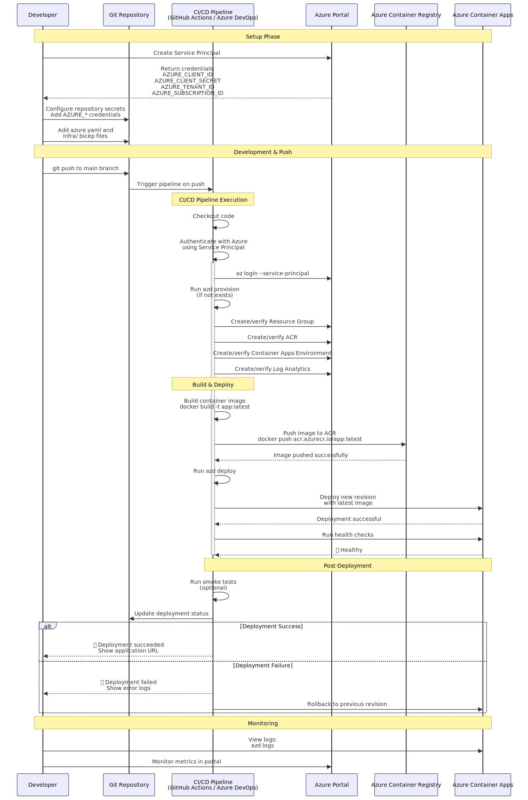

# Sandboxxer Plugin Diagrams

This directory contains Mermaid diagrams visualizing the sandboxxer plugin architecture, workflows, and data flows.

## Available Diagrams

### 1. Plugin Architecture

**File:** [`plugin-architecture.mmd`](plugin-architecture.mmd) | **SVG:** [`svg/plugin-architecture.svg`](svg/plugin-architecture.svg)

**Purpose:** Shows the component hierarchy of the sandboxxer plugin.

**Components visualized:**
- **Commands (5)**: `/quickstart`, `/yolo-vibe-maxxing`, `/troubleshoot`, `/audit`, `/deploy-to-azure`
- **Skills (2)**: `sandboxxer-troubleshoot`, `sandboxxer-audit`
- **Agents (2)**: `devcontainer-generator`, `devcontainer-validator`
- **Hooks (1)**: PreToolUse for Docker safety
- **Shared Resources**: Templates, data catalogs, language partials

**Used in:** README.md, docs/ARCHITECTURE.md



---

### 2. Quickstart Setup Flow

**File:** [`quickstart-flow.mmd`](quickstart-flow.mmd) | **SVG:** [`svg/quickstart-flow.svg`](svg/quickstart-flow.svg)

**Purpose:** Interactive setup workflow showing the `/quickstart` command process.

**Workflow:**
1. User runs `/quickstart`
2. Project type selection (9 language options)
3. Network restrictions decision
4. Optional firewall configuration with domain categories
5. DevContainer file generation

**Used in:** README.md, docs/features/SETUP-OPTIONS.md



---

### 3. File Generation Process

**File:** [`file-generation.mmd`](file-generation.mmd) | **SVG:** [`svg/file-generation.svg`](svg/file-generation.svg)

**Purpose:** Shows how templates are processed to generate DevContainer files.

**Flow:**
- **Input:** Templates, data catalogs, language partials
- **Processing:** Copy templates, append partials, replace placeholders, configure firewall
- **Output:** .devcontainer/ directory with Dockerfile, devcontainer.json, docker-compose.yml, init-firewall.sh

**Used in:** docs/ARCHITECTURE.md



---

### 4. Mode Selection

**File:** [`mode-selection.mmd`](mode-selection.mmd) | **SVG:** [`svg/mode-selection.svg`](svg/mode-selection.svg)

**Purpose:** Decision tree for selecting the appropriate Docker Compose mode.

**Modes:**
- **Standard Bind Mount** (`docker-compose.yml`) - Linux default, direct file editing
- **Volume Mode** (`docker-compose.volume.yml`) - Windows/macOS, fast I/O with volume
- **Prebuilt Mode** (`docker-compose.prebuilt.yml`) - CI/CD with pre-built images
- **Profiles Mode** (`docker-compose-profiles.yml`) - Backend/frontend service isolation

**Used in:** docs/features/SETUP-OPTIONS.md



---

### 5. Security Layers

**File:** [`security-layers.mmd`](security-layers.mmd) | **SVG:** [`svg/security-layers.svg`](svg/security-layers.svg)

**Purpose:** Visualizes the 3-layer security model.

**Layers:**
- **Layer 1: Container Isolation** - Namespaces, cgroups, capabilities, read-only filesystem
- **Layer 2: Network Isolation** - Firewall modes (disabled/strict), iptables + ipset, domain allowlist
- **Layer 3: Secret Management** - VS Code inputs, Docker secrets, host mounts

**Used in:** docs/features/SECURITY-MODEL.md



---

### 6. Troubleshooting Flow

**File:** [`troubleshooting-flow.mmd`](troubleshooting-flow.mmd) | **SVG:** [`svg/troubleshooting-flow.svg`](svg/troubleshooting-flow.svg)

**Purpose:** Decision tree for diagnosing and resolving common sandbox issues.

**Categories:**
- Container issues (startup, crashes, build errors)
- Network issues (connectivity, DNS, firewall)
- Service connection problems (PostgreSQL, Redis)
- Firewall blocking
- Permission errors
- VS Code DevContainer issues

**Used in:** docs/features/TROUBLESHOOTING.md



---

### 7. Azure Deployment Flow

**File:** [`azure-deployment-flow.mmd`](azure-deployment-flow.mmd) | **SVG:** [`svg/azure-deployment-flow.svg`](svg/azure-deployment-flow.svg)

**Purpose:** Multi-step Azure Container Apps deployment pipeline.

**Phases:**
1. Pre-flight validation (Docker, DevContainer, Azure CLI)
2. Authentication (interactive or service principal)
3. Configuration (subscription, environment, region, scaling)
4. Infrastructure generation (azure.yaml, Bicep modules)
5. Deployment process (provision, build, push, deploy)
6. Post-deployment verification

**Used in:** commands/deploy-to-azure.md, docs/features/AZURE-DEPLOYMENT.md


---

### 8. Secrets Flow

**File:** [`secrets-flow.mmd`](secrets-flow.mmd) | **SVG:** [`svg/secrets-flow.svg`](svg/secrets-flow.svg)

**Purpose:** Secret type decision tree and method selection.

**Secret Types:**
- **Development** - VS Code input variables
- **Build-time** - Docker build secrets (not in layers)
- **Runtime Production** - Docker runtime secrets (tmpfs)
- **Cloud CLI** - Host config mounts (read-only)

**Includes:** Secret lifecycle (creation → storage → distribution → usage → rotation → revocation) and anti-patterns to avoid

**Used in:** docs/features/SECRETS.md



---

### 9. Firewall Resolution

**File:** [`firewall-resolution.mmd`](firewall-resolution.mmd) | **SVG:** [`svg/firewall-resolution.svg`](svg/firewall-resolution.svg)

**Purpose:** Sequence diagram showing how firewall processes domain allowlists.

**Process:**
1. init-firewall.sh reads ALLOWED_DOMAINS
2. DNS resolution (domain → IP addresses)
3. ipset creation (IPs added to hash:net)
4. iptables rule application
5. Verification tests
6. Runtime enforcement

**Used in:** docs/features/SECURITY-MODEL.md


---

### 10. Security Audit Flow

**File:** [`security-audit-flow.mmd`](security-audit-flow.mmd) | **SVG:** [`svg/security-audit-flow.svg`](svg/security-audit-flow.svg)

**Purpose:** 12-step security audit workflow from `/sandboxxer:audit`.

**Audit Steps:**
1. Scan configuration files
2. Firewall configuration audit
3. Credentials and secrets audit
4. Port exposure audit
5. Container permissions audit
6. Volume and mount audit
7. Network isolation audit
8. Dependency security
9. Lifecycle hooks security
10. Dev Container features audit
11. Dotfiles security
12. Environment variables security

**Used in:** skills/sandboxxer-audit/SKILL.md


---

### 11. Service Connectivity

**File:** [`service-connectivity.mmd`](service-connectivity.mmd) | **SVG:** [`svg/service-connectivity.svg`](svg/service-connectivity.svg)

**Purpose:** Docker network topology and correct/incorrect connection patterns.

**Shows:**
- Docker bridge network architecture
- Correct patterns: Using service names (postgres:5432, redis:6379)
- Incorrect patterns: Using localhost or 127.0.0.1
- Docker DNS resolution process
- Common troubleshooting issues

**Used in:** docs/features/TROUBLESHOOTING.md



---

### 12. CI/CD Integration

**File:** [`cicd-integration.mmd`](cicd-integration.mmd) | **SVG:** [`svg/cicd-integration.svg`](svg/cicd-integration.svg)

**Purpose:** GitHub Actions / Azure DevOps pipeline sequence.

**Pipeline Stages:**
1. Setup: Service principal creation, repository secrets
2. Development: Code push triggers pipeline
3. CI/CD execution: Authentication, provision, build
4. Build & Deploy: Container build, ACR push, deployment
5. Post-deployment: Health checks, smoke tests, rollback
6. Monitoring: Logs and metrics

**Used in:** docs/features/AZURE-DEPLOYMENT.md



---

## Editing Diagrams

### Using Mermaid Live Editor (Recommended)

1. Open https://mermaid.live
2. Copy content from any `.mmd` file
3. Edit the diagram interactively
4. Download as SVG and save to `svg/` directory
5. Commit both `.mmd` source and `.svg` output

### Using Mermaid CLI

Requires Node.js and works in environments with browser support:

```bash
# Generate single diagram
npx -y @mermaid-js/mermaid-cli -i plugin-architecture.mmd -o svg/plugin-architecture.svg -b transparent

# Generate all diagrams
for file in *.mmd; do
    npx -y @mermaid-js/mermaid-cli -i "$file" -o "svg/${file%.mmd}.svg" -b transparent
done
```

**Note:** In Docker containers, you may need a puppeteer config to disable sandbox:

```json
{
  "args": ["--no-sandbox", "--disable-setuid-sandbox"]
}
```

Then use: `npx @mermaid-js/mermaid-cli -i <input> -o <output> -p puppeteer-config.json`

### Mermaid Syntax Reference

- **Flowchart:** `flowchart TD` (top-down) or `flowchart LR` (left-right)
- **Nodes:** `A[Rectangle]`, `B{Diamond}`, `C([Rounded])`
- **Edges:** `A --> B` (arrow), `A -.-> B` (dotted), `A -->|Label| B` (labeled)
- **Styling:** `style A fill:#90EE90,stroke:#333,stroke-width:2px`
- **Subgraphs:** `subgraph Title ... end`

Full reference: https://mermaid.js.org/intro/

---

## Color Coding

All diagrams follow this color scheme:

| Component Type | Color | Hex Code | Usage |
|----------------|-------|----------|-------|
| Commands | Light Green | `#90EE90` | Slash commands |
| Skills | Sky Blue | `#87CEEB` | Workflow skills |
| Agents | Orange | `#FFB366` | Subagents |
| Hooks | Red | `#FF6B6B` | Event hooks |
| Shared Resources | Purple | `#DDA0DD` | Templates/data |
| Decision Points | Peach | `#FFE4B5` | User choices |
| Processing | Light Gray | `#f0f0f0` | Internal processing |

---

## Embedding in Documentation

To embed diagrams in markdown files, use relative paths based on your file location.

**Syntax pattern:**

```

```

**Path examples based on file location:**

| Your file location | Path to use | Example |
|-------------------|-------------|---------|
| Repository root (e.g., README.md) | `docs/diagrams/svg/name.svg` | `plugin-architecture.svg` |
| Inside docs/ directory | `diagrams/svg/name.svg` | Used in ARCHITECTURE.md |
| Inside docs/diagrams/ | `svg/name.svg` | Used in this file |

**See existing embeddings:**
- README.md: View source to see diagram embeddings from repository root
- docs/ARCHITECTURE.md: View source to see diagram embeddings from docs/
- All embedded diagrams are in docs/diagrams/svg/ directory

---

## File Structure

```
docs/diagrams/
├── README.md                   # This file
├── puppeteer-config.json       # Config for Mermaid CLI in Docker
├── plugin-architecture.mmd     # Mermaid source files
├── quickstart-flow.mmd
├── file-generation.mmd
├── mode-selection.mmd
└── svg/                        # Generated SVG files
    ├── plugin-architecture.svg
    ├── quickstart-flow.svg
    ├── file-generation.svg
    └── mode-selection.svg
```

---

## Related Documentation

- [Plugin Architecture](../ARCHITECTURE.md) - Technical architecture overview
- [Setup Options](../features/SETUP-OPTIONS.md) - Command comparison and mode selection
- [Skills README](../../skills/README.md) - Skill documentation
- [Commands README](../../commands/README.md) - Command reference

---

**Last Updated:** 2025-12-25
**Version:** 4.6.0
